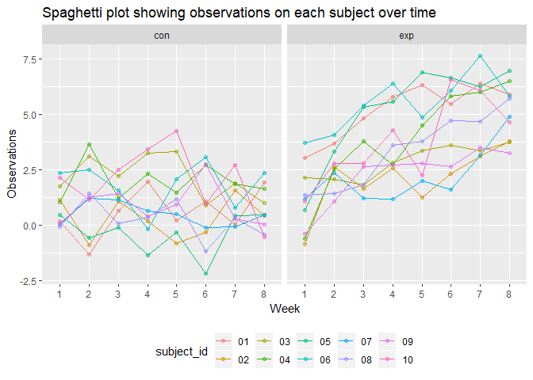
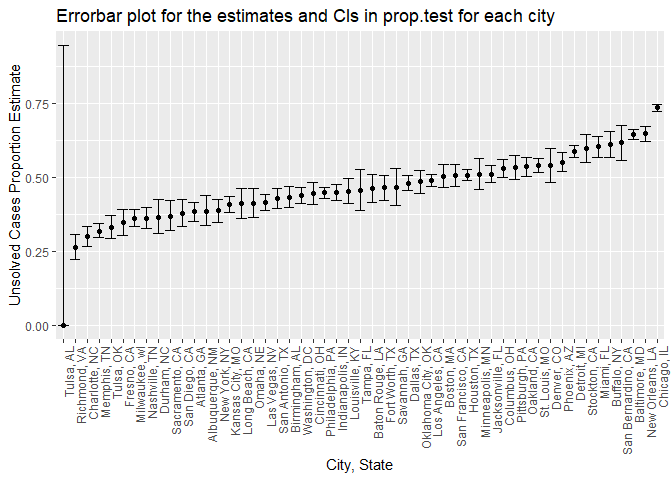

p8105\_hw5\_yg2625
================
Yue Gu
November 7, 2018

Library
-------

``` r
library(tidyverse)
library(rvest)
library(purrr)
```

Problem 1
---------

### Create dataframe containing all file names

``` r
file_df = tibble(
  list.files(path = "./data", pattern = "*.csv")
  )
names(file_df)[1] = "file_name"

file_df
```

    ## # A tibble: 20 x 1
    ##    file_name 
    ##    <chr>     
    ##  1 con_01.csv
    ##  2 con_02.csv
    ##  3 con_03.csv
    ##  4 con_04.csv
    ##  5 con_05.csv
    ##  6 con_06.csv
    ##  7 con_07.csv
    ##  8 con_08.csv
    ##  9 con_09.csv
    ## 10 con_10.csv
    ## 11 exp_01.csv
    ## 12 exp_02.csv
    ## 13 exp_03.csv
    ## 14 exp_04.csv
    ## 15 exp_05.csv
    ## 16 exp_06.csv
    ## 17 exp_07.csv
    ## 18 exp_08.csv
    ## 19 exp_09.csv
    ## 20 exp_10.csv

### Iterate over file names and read in data to save the result as a new variable in the dataframe

``` r
arm_df = 
  file_df %>% 
  mutate(path = str_c("./data/", file_name)) %>% 
  mutate(data = map(path, read_csv)) %>% 
  unnest()

arm_df
```

    ## # A tibble: 20 x 10
    ##    file_name path  week_1 week_2 week_3 week_4 week_5 week_6 week_7 week_8
    ##    <chr>     <chr>  <dbl>  <dbl>  <dbl>  <dbl>  <dbl>  <dbl>  <dbl>  <dbl>
    ##  1 con_01.c~ ./da~   0.2  -1.31    0.66   1.96   0.23   1.09   0.05   1.94
    ##  2 con_02.c~ ./da~   1.13 -0.88    1.07   0.17  -0.83  -0.31   1.58   0.44
    ##  3 con_03.c~ ./da~   1.77  3.11    2.22   3.26   3.31   0.89   1.88   1.01
    ##  4 con_04.c~ ./da~   1.04  3.66    1.22   2.33   1.47   2.7    1.87   1.66
    ##  5 con_05.c~ ./da~   0.47 -0.580  -0.09  -1.37  -0.32  -2.17   0.45   0.48
    ##  6 con_06.c~ ./da~   2.37  2.5     1.59  -0.16   2.08   3.07   0.78   2.35
    ##  7 con_07.c~ ./da~   0.03  1.21    1.13   0.64   0.49  -0.12  -0.07   0.46
    ##  8 con_08.c~ ./da~  -0.08  1.42    0.09   0.36   1.18  -1.16   0.33  -0.44
    ##  9 con_09.c~ ./da~   0.08  1.24    1.44   0.41   0.95   2.75   0.3    0.03
    ## 10 con_10.c~ ./da~   2.14  1.15    2.52   3.44   4.26   0.97   2.73  -0.53
    ## 11 exp_01.c~ ./da~   3.05  3.67    4.84   5.8    6.33   5.46   6.38   5.91
    ## 12 exp_02.c~ ./da~  -0.84  2.63    1.64   2.58   1.24   2.32   3.11   3.78
    ## 13 exp_03.c~ ./da~   2.15  2.08    1.82   2.84   3.36   3.61   3.37   3.74
    ## 14 exp_04.c~ ./da~  -0.62  2.54    3.78   2.73   4.49   5.82   6      6.49
    ## 15 exp_05.c~ ./da~   0.7   3.33    5.34   5.57   6.9    6.66   6.24   6.95
    ## 16 exp_06.c~ ./da~   3.73  4.08    5.4    6.41   4.87   6.09   7.66   5.83
    ## 17 exp_07.c~ ./da~   1.18  2.35    1.23   1.17   2.02   1.61   3.13   4.88
    ## 18 exp_08.c~ ./da~   1.37  1.43    1.84   3.6    3.8    4.72   4.68   5.7 
    ## 19 exp_09.c~ ./da~  -0.4   1.08    2.66   2.7    2.8    2.64   3.51   3.27
    ## 20 exp_10.c~ ./da~   1.09  2.8     2.8    4.3    2.25   6.57   6.09   4.64

### Tidy the resulting data and manipulate file names to include control arm and subject ID and furtherly gather the data and modified week column

``` r
arm_tidy =
  arm_df %>% 
  select(-path) %>% 
  mutate(file_name = str_replace(file_name, ".csv", "")) %>% 
  separate(file_name, into = c("arm", "subject_id"), sep = "_") %>% 
  gather(key = week, value = obs, week_1:week_8) %>% 
  mutate(week = str_replace(week, "week_", ""))

head(arm_tidy, 10)  
```

    ## # A tibble: 10 x 4
    ##    arm   subject_id week    obs
    ##    <chr> <chr>      <chr> <dbl>
    ##  1 con   01         1      0.2 
    ##  2 con   02         1      1.13
    ##  3 con   03         1      1.77
    ##  4 con   04         1      1.04
    ##  5 con   05         1      0.47
    ##  6 con   06         1      2.37
    ##  7 con   07         1      0.03
    ##  8 con   08         1     -0.08
    ##  9 con   09         1      0.08
    ## 10 con   10         1      2.14

### Make a spaghetti plot

``` r
arm_tidy %>%
  ggplot(aes(x = week, y = obs, group = subject_id, color = subject_id)) +
  geom_point(alpha = .5) +
  geom_line() +
  facet_grid(~arm) +
  theme(legend.position = "bottom") +
  labs(title = "Spaghetti plot showing observations on each subject over time",
       x = "Week",
       y = "Observations")
```



#### By spaghetti plot, we could observe that experimental arm group have relatively higher mean of observations than control arm group. And oberservations increases over time in experimental group while the observations in control group fluctuate around the original value without a clear increasing or decreasing pattern.

Problem 2
---------

### Import and describe the raw data

``` r
homi_raw = read_csv("https://raw.githubusercontent.com/washingtonpost/data-homicides/master/homicide-data.csv")
```

    ## Parsed with column specification:
    ## cols(
    ##   uid = col_character(),
    ##   reported_date = col_integer(),
    ##   victim_last = col_character(),
    ##   victim_first = col_character(),
    ##   victim_race = col_character(),
    ##   victim_age = col_character(),
    ##   victim_sex = col_character(),
    ##   city = col_character(),
    ##   state = col_character(),
    ##   lat = col_double(),
    ##   lon = col_double(),
    ##   disposition = col_character()
    ## )

``` r
nrow(homi_raw)
```

    ## [1] 52179

``` r
ncol(homi_raw)
```

    ## [1] 12

#### The raw data containing 52179 observations with 12 variables including subject id, case reported date, victim's last and first name, victim's race, age and sex, case happend city and state with latitude and longtitude, and disposition. And the Washington Post collected the data on criminal homicides over the past decade in 50 of the largest American cities.

### Create a city\_state variable (e.g. “Baltimore, MD”) and then summarize within cities to obtain the total number of homicides and the number of unsolved homicides

``` r
homi_create =
  homi_raw %>% 
  mutate(city_state = paste(city, state, sep = ", ")) %>% 
  group_by(city_state) %>% 
  summarize(homi_total = n(),
            homi_unsoloved = sum(disposition == "Closed without arrest" | disposition == "Open/No arrest"))

head(homi_create, 10)
```

    ## # A tibble: 10 x 3
    ##    city_state      homi_total homi_unsoloved
    ##    <chr>                <int>          <int>
    ##  1 Albuquerque, NM        378            146
    ##  2 Atlanta, GA            973            373
    ##  3 Baltimore, MD         2827           1825
    ##  4 Baton Rouge, LA        424            196
    ##  5 Birmingham, AL         800            347
    ##  6 Boston, MA             614            310
    ##  7 Buffalo, NY            521            319
    ##  8 Charlotte, NC          687            206
    ##  9 Chicago, IL           5535           4073
    ## 10 Cincinnati, OH         694            309

#### total\_homi stands for the total number of homicides; homi\_unsolved stands for the number of unsolved homicides

### For the city of Baltimore, MD, use the prop.test function to estimate the proportion of homicides that are unsolved

``` r
baltimore_prop = prop.test(1825, 2827)
baltimore_prop
```

    ## 
    ##  1-sample proportions test with continuity correction
    ## 
    ## data:  1825 out of 2827, null probability 0.5
    ## X-squared = 239.01, df = 1, p-value < 2.2e-16
    ## alternative hypothesis: true p is not equal to 0.5
    ## 95 percent confidence interval:
    ##  0.6275625 0.6631599
    ## sample estimates:
    ##         p 
    ## 0.6455607

### Apply the broom::tidy to this object and pull the estimated proportion and confidence intervals from the resulting tidy dataframe

``` r
baltimore_prop %>% 
  broom::tidy() %>% 
  select(estimate, conf.low, conf.high) %>% 
  knitr::kable(digits = 3)
```

|  estimate|  conf.low|  conf.high|
|---------:|---------:|----------:|
|     0.646|     0.628|      0.663|

#### Hence, the estimate proportion is 0.646 with confidence interval (0.628, 0.663)

### Now run prop.test for each of the cities in your dataset, and extract both the proportion of unsolved homicides and the confidence interval for each

``` r
homi_prop_test =
  homi_create %>% 
  mutate(prop_test = map2(homi_total, homi_unsoloved, ~prop.test(.y, .x) %>% broom::tidy())) %>% 
  unnest() %>% 
  select(city_state, homi_total, homi_unsoloved, estimate, conf.low, conf.high)
```

    ## Warning in prop.test(.y, .x): Chi-squared approximation may be incorrect

``` r
head(homi_prop_test, 10)
```

    ## # A tibble: 10 x 6
    ##    city_state      homi_total homi_unsoloved estimate conf.low conf.high
    ##    <chr>                <int>          <int>    <dbl>    <dbl>     <dbl>
    ##  1 Albuquerque, NM        378            146    0.386    0.337     0.438
    ##  2 Atlanta, GA            973            373    0.383    0.353     0.415
    ##  3 Baltimore, MD         2827           1825    0.646    0.628     0.663
    ##  4 Baton Rouge, LA        424            196    0.462    0.414     0.511
    ##  5 Birmingham, AL         800            347    0.434    0.399     0.469
    ##  6 Boston, MA             614            310    0.505    0.465     0.545
    ##  7 Buffalo, NY            521            319    0.612    0.569     0.654
    ##  8 Charlotte, NC          687            206    0.300    0.266     0.336
    ##  9 Chicago, IL           5535           4073    0.736    0.724     0.747
    ## 10 Cincinnati, OH         694            309    0.445    0.408     0.483

### Create a plot that shows the estimates and CIs for each city

``` r
homi_prop_test %>% 
  mutate(city_state = forcats::fct_reorder(city_state, estimate)) %>% 
  ggplot(aes(x = city_state, y = estimate)) +
  geom_point() +
  geom_errorbar(aes(ymin = conf.low, ymax = conf.high)) +
  labs(title = "Errorbar plot for the estimates and CIs in prop.test for each city",
        x = "City, State",
        y = "Unsolved Cases Proportion Estimate") +
  theme(axis.text.x = element_text(angle = 90, hjust = 1))
```



#### The cities in errorbar plot is reorganized according to the proportion of unsolved homicides. And since Tulsa, AL only has 1 homicide case, its errorbar is unique without large cases numbers compared to other cities.
